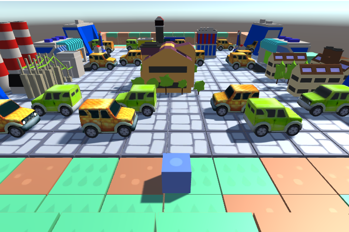

# CrossRoad video game made in Unity 3D



## Introduction

This project is the result of a series of tutorials made for the internet, in which I make a 3D video game using unity, explaining a little the basic functions, the structure of the IDE and folder organization.

The objective of the game is to cross the city passing through some traffic routes where cars are generated randomly, the game will end once we reach the other side of the street.

## Usage

```
1) Clone or download this repository
```

```
2) In the Game folder you will find the .exe to run the game
```

## Example 

 [Youtube](https://youtu.be/KyTSw56466Y) 

## License

This code is open-sourced software licensed under the [MIT license.](https://opensource.org/licenses/MIT)